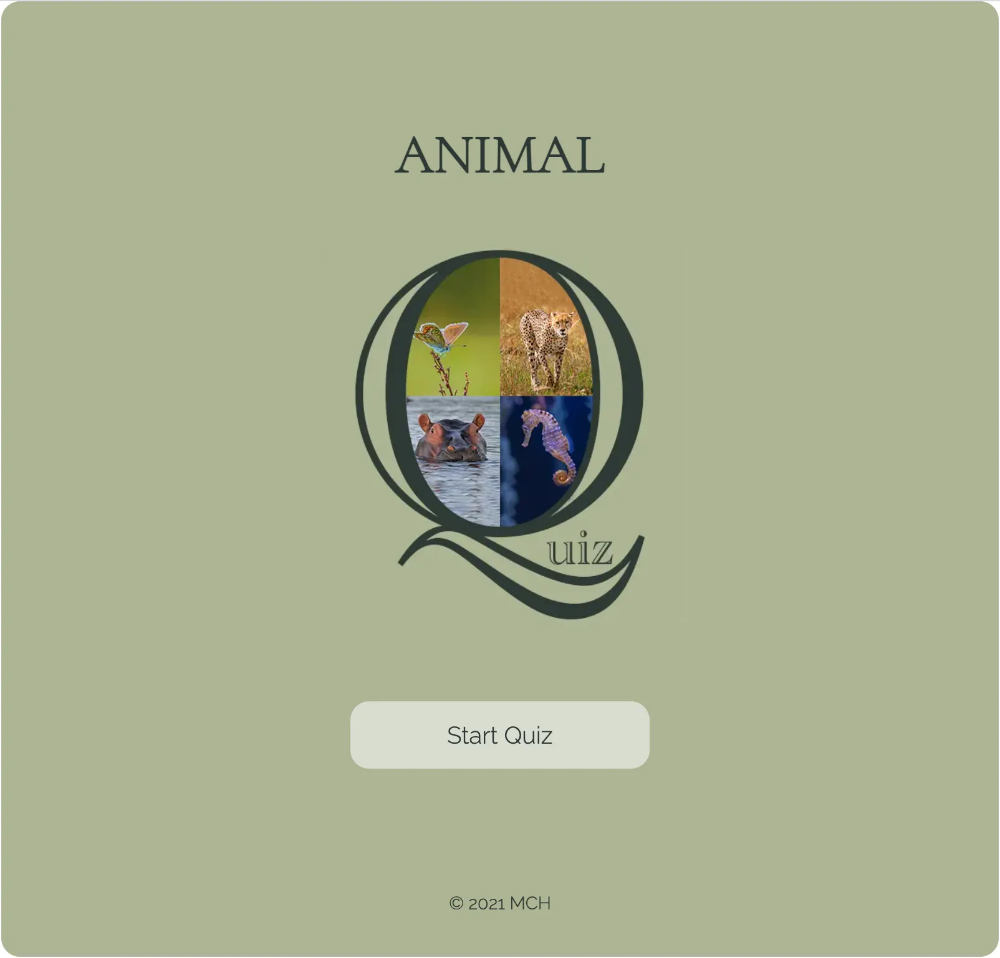
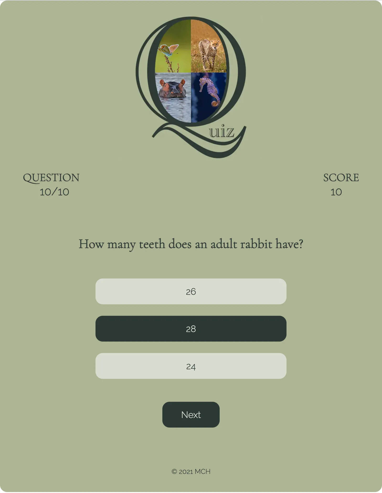
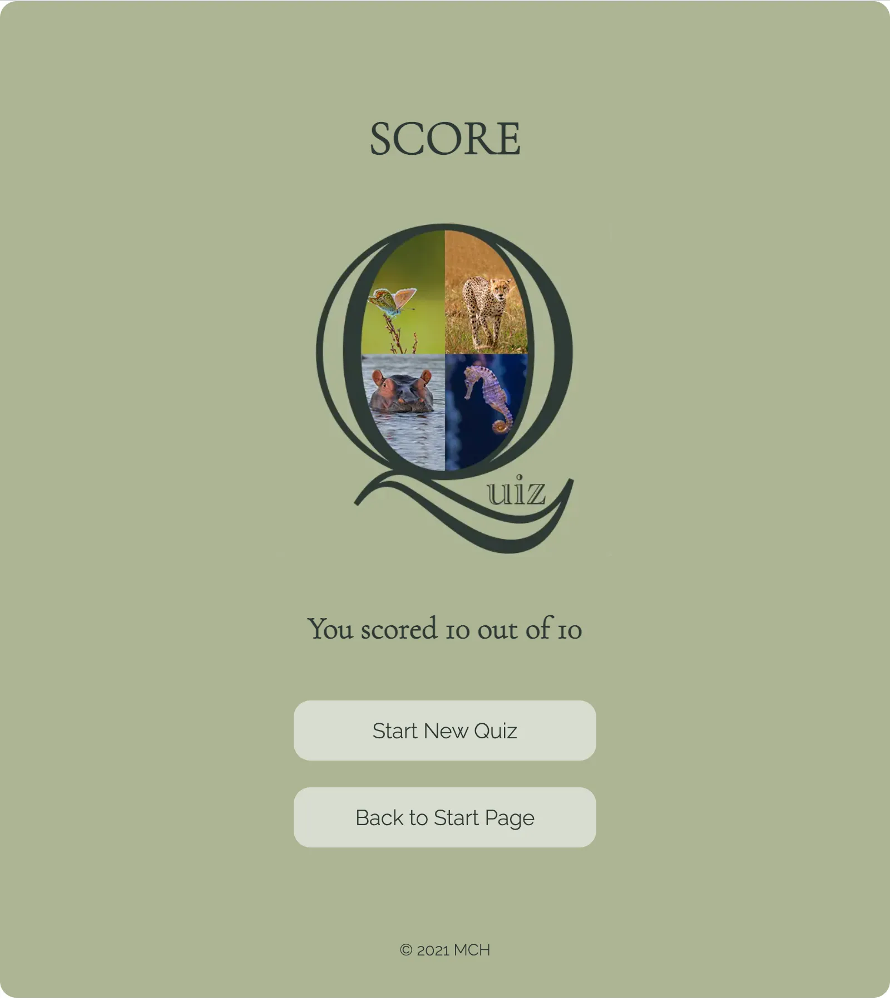

# Animal Quiz

Animal Quiz is a game that aims to test people's knowledge about animals. The game is targeted towards people who want to check what they know about different animals in the world. Animal Quiz will be useful for people in that it is a fun way to test what they know about animals and maybe learn more about them.

<!-- A link to the live website can be found [here](https://mariechessler.github.io/a-quiz/index.html), and a link to the repository [here](https://github.com/MarieCHessler/a-quiz).

 -->

 

## Table of contents
1. [Design](https://github.com/MarieCHessler/a-quiz#design)
    * [Color Palette](https://github.com/MarieCHessler/a-quiz#color-palette)
    * [Typography](https://github.com/MarieCHessler/a-quiz#typography)
    * [Layout](https://github.com/MarieCHessler/a-quiz#layout)
    * [Wireframes](https://github.com/MarieCHessler/a-quiz#wireframes)

2. [Features](https://github.com/MarieCHessler/a-quiz#features)
    * [Existing features](https://github.com/MarieCHessler/a-quiz#existing-features)
    * [Features for the future](https://github.com/MarieCHessler/a-quiz#features-for-the-future)

3. [Technology used](https://github.com/MarieCHessler/a-quiz#technology-used)

4. [Testing](https://github.com/MarieCHessler/a-quiz#testing)
    * [Validator testing](https://github.com/MarieCHessler/a-quiz#validator-testing)
    * [Manual testing](https://github.com/MarieCHessler/a-quiz#manual-testing)

5. [Bugs](https://github.com/MarieCHessler/a-quiz#bugs)
    * [Fixed bugs](https://github.com/MarieCHessler/a-quiz#fixed-bugs)
    * [Known issues](https://github.com/MarieCHessler/a-quiz#known-issues)

6. [Deployment](https://github.com/MarieCHessler/a-quiz#deployment)
    * [GitHub Pages](https://github.com/MarieCHessler/a-quiz#github-pages)

7. [Credits](https://github.com/MarieCHessler/a-quiz#credits)
    * [Content](https://github.com/MarieCHessler/a-quiz#content)
    * [Media](https://github.com/MarieCHessler/a-quiz#media)
    * [Special thanks to](https://github.com/MarieCHessler/a-quiz#special-thanks-to)

     

    ## Design

     

    

    ### Color Palette

    * The game's primary colors are (from left to right) Outer Space Crayola, Laurel Green and Timberwolf, as seen in the picture above. They were derived using the online tool Coolors, to make sure they complement and contrast each other in a good way.
      * **Outer Space Crayola** is used for headlines and text, as contrasting background color on buttons, as background hover color for choices and as hover color for button texts.
      * **Laurel Green** is used as background color for the general container, and also for the body for tablets and mobiles. 
      * **Timberwolf** is used as contrasting background color for choices, as background hover color for buttons and as hover color for choice texts.
    * The colors are all nuances of green, to mirror nature and enhance the connection with the animal kingdom.

    ### Typography

    * Cormorant Garamond is used for headings, since it fits with the Q in the image. Fallback font is serif.
    * Raleway is used for body, scores, choices and buttons, since it is easy to read and complements Cormorant Garamond well. Fallback font is sans serif
    * Both fonts are from Google Fonts, and a good font pairing according to the site Davey & Crista that focuses on brand strategy and design.

    ### Layout
    
    * The content has been divided into three different pages. This way the quiz page, with the questions, is separated from the finish page, where the final score is presented, and the landing page, where you start.
    * For desktop and laptops the colored background has been limited to the general container, to keep the eyes' focus mid screen. For tablets and mobiles the whole background is colored.

    ### Wireframes

    * Wireframes were used to structure the page content for desktop, tablet, and mobile screens. The structure does not vary a lot between the different screens, since the content is kept mid screen for the game, but margins, image sizes and font sizes vary.

     

    

     

    ##Features

    The features described below have been implemented for the user to have a good experience, with a game that contains text and images that are easy to follow and navigate.

    ### Existing features

    **Landing page**
    * The landing page includes the heading ANIMAL, an image consisting of a Q with four animals in it and the letters u,i and z on the outside, and a button to start the game.
    * The heading, together with the animals, makes it easy for the user to understand what the quiz is about.
    * The quiz image enhances the understanding.
    * The button invites the user to start the game.

    

     

    **Quiz page**
    * The quiz page is where the actual game takes place, and includes the Q image, a heads up display with question number and score, the question, three choices and a button.
    * The Q image helps user recognition.
    * The heads up display allowes the user contant access to information regarding what question he or she is on, how many questions are left, and what score has been accomplished so far.
    * For the user's eyes to easily find the question, it has been placed in the center.
    * The answer choices shift color when the pointer hovers over them and when they are clicked, to make it easy for the user to follow what has been selected and not.
    * Questions and choices are collected from a separate js file.
    * The button below the choices says "Next" and invites the user to launch the next question or page.

    

     

    **Score page**
    * The score page is the end page of the game, where the final score is presented and the user can choose to start a new game or go back to the landing page.
    * The page includes the heading SCORE, the Q image, a text telling the user he or she scored a number out of 10, one button that says "Start new quiz" and one that says "Back to start page".
    * The layout of the page is similar to that of the landing page, for recogniton.
    * The heading makes it evident for the user what is presented on the page.
    * The Q image helps user recognition.
    * For the user's eyes to easily find the result, it has been placed in the center.
    * The buttons below the score text invite the user to choose between starting a new game and returning to the landing page.

    

     

    **Footer section**
    * The footer section is located in the game container on all three pages and includes copyright information.

    
    
     

    ### Features for the future
    * An image connected to each question.
    * Possibility to choose different levels of difficulty.
    * More subjects to choose from.
    * Question presented like a card, that flips and shows the right answer, when the user has made his or her choice. For a better learning experience.
    * High score.

     

    ## Technology used

    * 