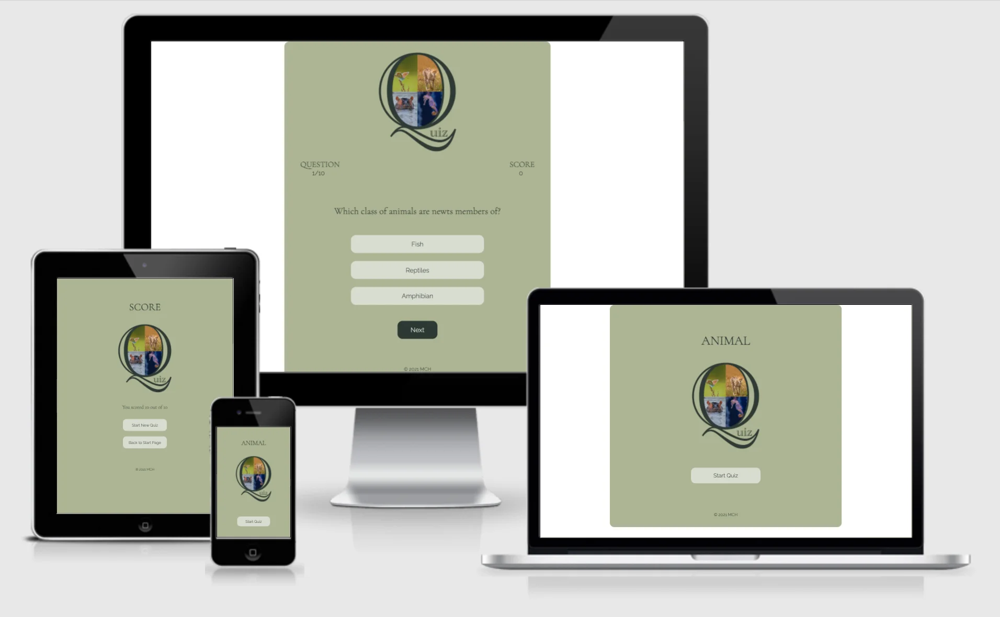
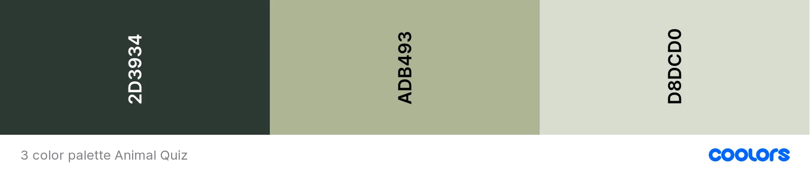
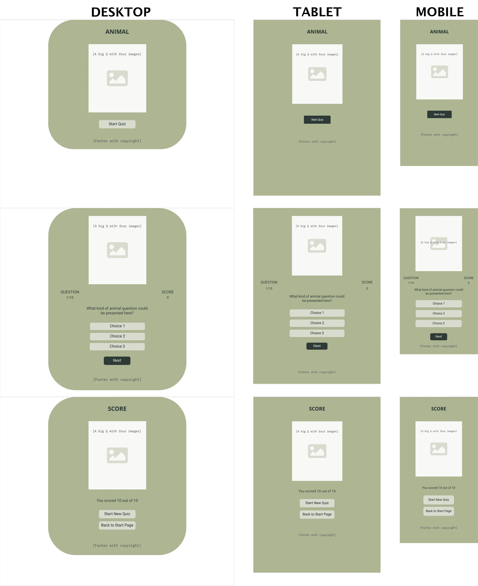
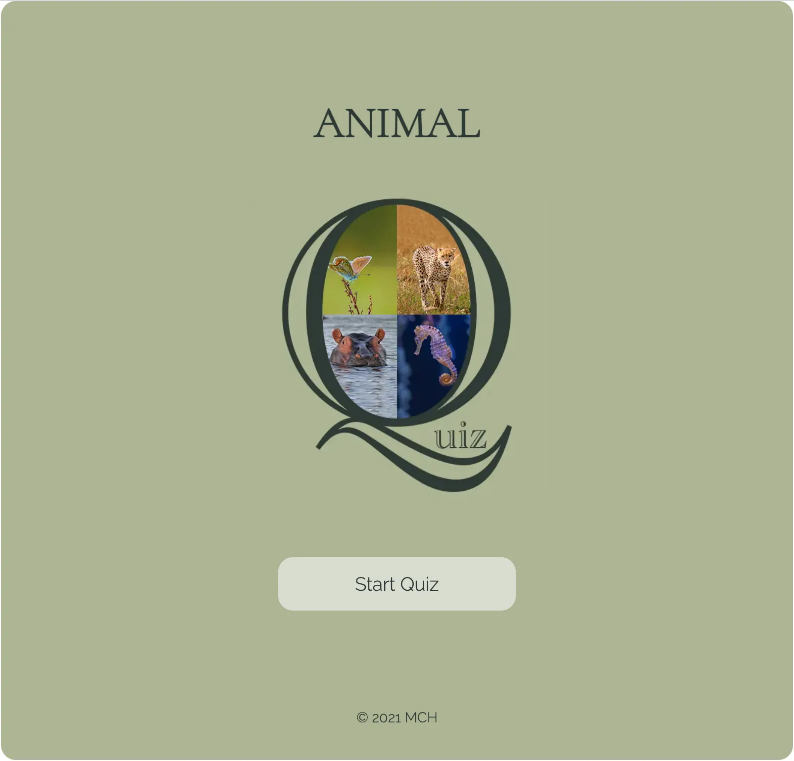
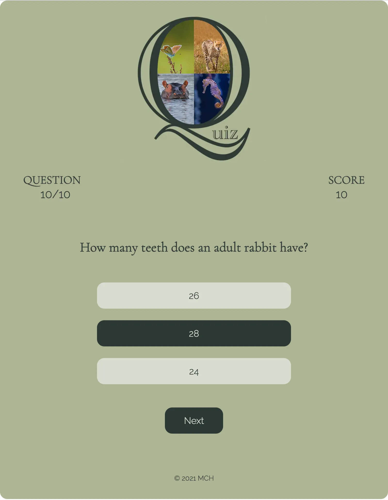
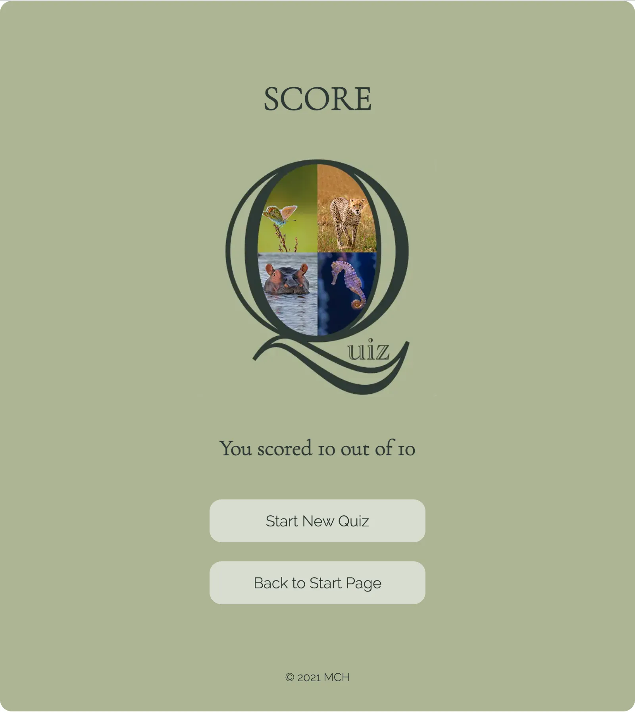
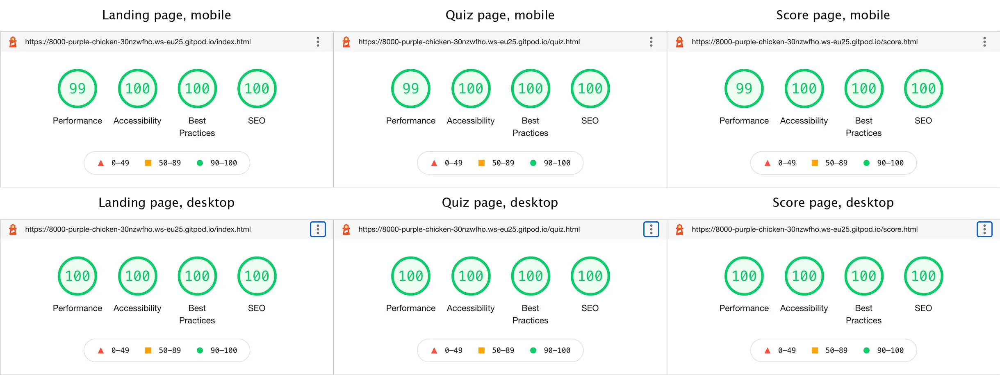

# Animal Quiz

Animal Quiz is a game that aims to test people's knowledge about animals. The game is targeted towards people who want to check what they know about different animals in the world. Animal Quiz will be useful for people in that it is a fun way to test what they know about animals and maybe learn more about them.

A link to the live website can be found [here](https://mariechessler.github.io/a-quiz/), and a link to the repository [here](https://github.com/MarieCHessler/a-quiz).

 

## Table of contents
1. [Design](https://github.com/MarieCHessler/a-quiz#design)
    * [Color Palette](https://github.com/MarieCHessler/a-quiz#color-palette)
    * [Typography](https://github.com/MarieCHessler/a-quiz#typography)
    * [Layout](https://github.com/MarieCHessler/a-quiz#layout)
    * [Wireframes](https://github.com/MarieCHessler/a-quiz#wireframes)

2. [Features](https://github.com/MarieCHessler/a-quiz#features)
    * [Existing features](https://github.com/MarieCHessler/a-quiz#existing-features)
    * [Features for the future](https://github.com/MarieCHessler/a-quiz#features-for-the-future)

3. [Technology used](https://github.com/MarieCHessler/a-quiz#technology-used)

4. [Testing](https://github.com/MarieCHessler/a-quiz#testing)
    * [Validator testing](https://github.com/MarieCHessler/a-quiz#validator-testing)
    * [Manual testing](https://github.com/MarieCHessler/a-quiz#manual-testing)

5. [Bugs](https://github.com/MarieCHessler/a-quiz#bugs)
    * [Fixed bugs](https://github.com/MarieCHessler/a-quiz#fixed-bugs)
    * [Known issues](https://github.com/MarieCHessler/a-quiz#known-issues)

6. [Deployment](https://github.com/MarieCHessler/a-quiz#deployment)
    * [GitHub Pages](https://github.com/MarieCHessler/a-quiz#github-pages)

7. [Credits](https://github.com/MarieCHessler/a-quiz#credits)
    * [Content](https://github.com/MarieCHessler/a-quiz#content)
    * [Media](https://github.com/MarieCHessler/a-quiz#media)
    * [Special thanks to](https://github.com/MarieCHessler/a-quiz#special-thanks-to)

     

    ## Design

     

    

    ### Color Palette

    * The game's primary colors are (from left to right) Outer Space Crayola, Laurel Green and Timberwolf, as seen in the picture above. They were derived using the online tool Coolors, to make sure they complement and contrast each other in a good way.
        * **Outer Space Crayola** is used for headlines and text, as contrasting background color on buttons, as background hover color for choices and as hover color for button texts.
        * **Laurel Green** is used as background color for the general container, and also for the body for tablets and mobiles. 
        * **Timberwolf** is used as contrasting background color for choices, as background hover color for buttons and as hover color for choice texts.
    * The colors are all nuances of green, to mirror nature and enhance the connection with the animal kingdom.

    ### Typography

    * Cormorant Garamond is used for headings, since it fits with the Q in the image and looks professional. Fallback font is serif.
    * Raleway is used for body, scores, choices and buttons, since it is easy to read and complements Cormorant Garamond well. Fallback font is sans serif
    * Both fonts are from Google Fonts, and a good font pairing according to the site Davey & Crista that focuses on brand strategy and design.

    ### Layout
    
    * The content has been divided into three different pages. This way the quiz page, with the questions, is separated from the end page, where the final score is presented, and the landing page, where you start.
    * For desktop and laptops the colored background has been limited to the general container, to keep the eyes' focus mid screen. For tablets and mobiles the whole background is colored.

    ### Wireframes

    * Wireframes were used to structure the page content for desktop, tablet, and mobile screens. The structure does not vary a lot between the different screens, since the content is kept mid screen for the game, but margins, image sizes and font sizes vary.

     

    

     

    ## Features

    The features described below have been implemented for the user to have a pleasant and fun experience, with a game that contains text, images and buttons that are easy to understand and makes the flow hassle free.

    ### Existing features

    **Landing page**
    * The landing page includes the heading ANIMAL, a quiz image, and a button to start the game.
    * The heading, together with the animals, makes it easy for the user to understand what the quiz is about.
    * The image, consisting of a Q with four animals inside and "uiz" on the outside, enhances the understanding.
    * The button invites the user to start the game.

    

     

    **Quiz page**
    * The quiz page is where the actual game takes place, and includes the Q image, a heads up display with question number and score, the question, three choices and a button.
    * The Q image helps user recognition.
    * The heads up display allows the user constant access to information regarding what question he or she is on, how many questions are left, and what score has been accomplished so far.
    * For the user's eyes to easily find the question, it has been placed in the center.
    * The answer choices shift color when the user hovers over them and when they are clicked, to make it easy for the user to follow what has been selected and not. See middle choice in image below.
    * Questions and choices are collected from a separate js file.
    * The button below the choices says "Next" and invites the user to launch the next question or page.

    

     

    **Score page**
    * The score page is the end page of the game, where the final score is presented and the user can choose to start a new game or go back to the landing page.
    * The page includes the heading SCORE, the Q image, a text telling the user he or she scored a certain number out of 10, one button that says "Start New Quiz" and one that says "Back to Start Page".
    * The layout of the page is similar to that of the landing page, for recogniton.
    * The heading makes it clear to the user what is presented on the page.
    * The Q image helps user recognition.
    * For the user's eyes to easily find the result, it has been placed in the center.
    * The buttons below the score text invite the user to choose between starting a new game and returning to the landing page.

    

     

    **Footer section**
    * The footer section is located in the game container on all three pages and includes copyright information.

    
    
     

    ### Features for the future
    * An image connected to each question.
    * Possibility to choose different levels of difficulty.
    * More subjects to choose from.
    * Question presented like a card that flips and shows the right answer when the user has made his or her choice. For a better learning experience.
    * High score.
    * Better layout, fit for laptops.

     

    ## Technology used

    * **[Convertio](https://convertio.co)**  
    Used to covert png files to ico files. 

    * **[Coolors](https://coolors.co)**  
    Used to find suitable colors that complement each other.

    * **[CSS](https://www.w3schools.com/css/default.asp)**  
    Used for site styling and responsiveness.

    * **[Font Awesome](https://fontawesome.com)**  
    Used for icons used for illustrations.

    * **[Git](https://git-scm.com/)**  
    Used for version control, by using GitHub terminal for git commits and push to GitHub.

    * **[GitHub](https://github.com/)**  
    Used to backup and store project code, including changes, and deploy.

    * **[Gitpod](https://www.gitpod.io/)**  
    IDE used for programming, editing, and debugging.

    * **[Google Chrome DevTools](https://developer.chrome.com/docs/devtools/)**  
    Used for checking responsiveness, trying alternative code solutions, and testing performance, accessibility, best practices and SEO.

    * **[Google Fonts](https://fonts.google.com)**  
    Used to find and import the fonts Raleway and Montez that are used across the sites.

    * **[HTML](https://www.w3schools.com/html/)**  
    Used for site content and structure.

    * **[JavaScript](https://www.w3schools.com/js/)**  
    Used for site behavior and interaction.

    * **[JSHint](https://jshint.com/)**  
    Used to validate JavaScript code.

    * **[Microsoft Word](https://www.microsoft.com/en-us/microsoft-365/word)**  
    Used for spellchecking text.

    * **[Photoshop](https://www.adobe.com/products/photoshop.html)**  
    Used for editing images and illustrations.

    * **[Squoosh](https://squoosh.app)**  
    Used to reduce file size in images.

    * **[W3C (Jigsaw) validator](https://jigsaw.w3.org/css-validator/#validate_by_input)**  
    Used to validate CSS code.

    * **[W3C validator](https://validator.w3.org/#validate_by_input)**  
    Used to validate HTML code

     

    ## Testing
    The site has been tested by validator and manually. Details can be found in the sections below.

     

    ### Validator testing
    * **HTML**  
        * No errors or warnings were found on index.html, quiz.html or score.html, then passing through the official [W3C validator](https://validator.w3.org/#validate_by_input).

         
    
    * **CSS**  
        * No errors were found on style.css, when passing through the official [W3C (Jigsaw) validator](https://jigsaw.w3.org/css-validator/#validate_by_input).
        * One warning was returned, saying "Imported style sheets are not checked in direct input and file upload modes".

         
    
    * **JavaScript**  
        * No errors were found on script.js, questions.js or score.js when passing through the linter [JSHint](https://jshint.com/).
        * The following warnings were returned, and good to keep in mind:
            * 'let' is available in ES6 (use 'esversion: 6') or Mozilla JS extensions (use moz).
            * 'arrow function syntax (=>)' is only available in ES6 (use 'esversion: 6').
            * 'template literal syntax' is only available in ES6 (use 'esversion: 6').
            * 'const' is available in ES6 (use 'esversion: 6') or Mozilla JS extensions (use moz).
        * The following variable came up as undefined, although it is defined:
            * questions (in script.js and questions.js)

        
    
    ### Manual testing
    * **The following has been checked manually on different devices and in different browsers:**
        * Links and buttons work properly.
        * Question number and score are updated for each new question.
        * Hover effect and selection color work for buttons and choices.
        * New question appears when "Next" button is clicked.
        * Correct choices are presented with each new question.
        * Final score is presented when last question has been answered.
        * Responsiveness works, and no content moves in unexpected ways when screen size is changed.

     

    * **The following devices and browsers have been used:**
        * iMac 27"
        * MacBook Pro 13"
        * iPad generation 6
        * iPhone XR and 11
        * HP ProBook
        * Safari - Version 15.1 (17612.2.9.1.20)
        * Chrome - Version 97.0.4692.71 (Official version) (x86_64)
        * Edge - Version 97.0.1072.55 (Official version) (64 bit)

     

    * **The site's responsiveness has been checked in Google Chrome DevTools throughout the project.**

     

    * **The site has been run in Lighthouse** (part of Google Chrome DevTools)
        * Results for the landing page, quiz page and score page on mobile and desktop on January 10, 2022.

    

    * **The reasons the score is less than 100% on Performance on mobile are the following:**
        * Serve static assets with an efficient cache policy - only quiz page.
        * Avoid chaining critical requests - all three pages.
        * Keep request counts low and transfer sizes small - all three pages.
        * Largest Contentful Paint element - all three pages.
        * Avoid large layout shifts - all three pages.
        * Avoid long main-thread tasks - all three pages.

 

## Bugs
The bugs reported in the following section are a selection of the most prominent ones, that needed extra consideration and work.

### Fixed bugs
* **Bug:** No change in color when selected choice is clicked.  
    **Fix:** Add .choice:focus to the CSS.

 

* **Bug:** Too few of the questions are presented and the wrong scores are shown.  
    **Fix:** Remove nextQuestion from within function and add "Next" button.

 

* **Bug:** Final score not showing on score page.  
    **Fix:** Use local storage.

 

* **Bug:** Rounded corners on larger screens not working with footer.  
    **Fix:** Include footer in general container.

 

* **Bug:** Image not changing size.  
    **Fix:** Make image responsive by setting the max width to 100% and the height to auto.

 

* **Bug:** Color for selected choice and "Next" button stopped working.  
    **Fix:** Replace focus on class choice in CSS with new class selectedChoice and related function.

 

### Known issues
* No other known remaining bugs

 

## Deployment

### GitHub Pages
The site was deployed to GitHub pages by following these steps:  

* Log in to GitHub.
* Go to the GitHub repository.
* Click on Settings.
* Scroll down to the GitHub Pages section and click on "Check it out here!".
* Under Source, click the arrow and choose Branch: main.
* After a little while the page is automatically refreshed and you get a message on green background, saying "Your site is published at: ...", with a link to your site, showing that your deployment was successful.

The live link can be found here: https://mariechessler.github.io/a-quiz/

 

## Credits

The references mentioned in this section have been used for content and media. Special thanks at the end.

### Content
* **Inspiration on how to create a quiz - 1**  
    Title: Create a Multiple Choice Quiz App Using JavaScript  
    Author: *Code Explained*  
    Date: Oct 18, 2018  
    URL: https://www.youtube.com/watch?v=49pYIMygIcU

 

* **Inspiration on how to create a quiz - 2**  
    Title: Creating a Basic Quiz - JavaScript Tutorial  
    Author: *Zenva*  
    Date: Dec 15, 2020  
    URL: https://www.youtube.com/watch?v=RswgVWKJRLM

 

* **Inspiration on how to create a quiz - 3**  
    Title: Build a Quiz App with HTML, CSS, and JavaScript  
    Author: *James Q Quick*  
    Date: Feb 18, 2019  
    URL: https://www.youtube.com/playlist?list=PLDlWc9AfQBfZIkdVaOQXi1tizJeNJipEx

 

* **Help with issue connected to too few questions presented and wrong score showing**  
    Title: Solution to question and score issue  
    Author: *Dave Horrocks*, Slack community  
    Date: Dec 21, 2021  
    Autor tip: "getNextQuestion" is being called in a loop, which is causing the problem.

 

* **Solution to how to change color on clicked choice**  
    Title: How to keep :active css style after click a button  
    Author: *SW4*  
    Date: Jul 2, 2015  
    URL: https://stackoverflow.com/questions/31178653/how-to-keep-active-css-style-after-click-a-button

 

* **Inspiration on how to move the final score to the end page**  
    Title: Web Storage API  
    Author: *W3Schools*  
    Date: 2021  
    URL: https://www.w3schools.com/js/js_api_web_storage.asp

 

* **How to make text uppercase**  
    Title: CSS text-transform Property  
    Author: *W3Schools*  
    Date: 2021  
    URL: https://www.w3schools.com/cssref/pr_text_text-transform.asp

 

* **How to make image responsive**  
    Title: CSS Styling Images  
    Author: *W3Schools*  
    Date: 2021  
    URL: https://www.w3schools.com/css/css3_images.asp

 

* **Help to solve problem with the color for selected choice and "Next" button not working properly**  
    Title: Solution color and selection issue  
    Author: *Reuben Ferrante*, mentor  
    Date: Jan 10, 2022  
    Mentor tip: Remove focus from the class choice in CSS, and create a new class and a function that handle the color and selection issues.

 

* **Info on how to rearrange code for better flow**  
    Title: How to arrange code  
    Author: *Reuben Ferrante*, mentor  
    Date: Jan 10, 2022  
    Mentor tip: Remove focus from the class choice in CSS, and create a new class and a function that handle the color and selection issues.

 

* **Questions for quiz**  
    Title: Animal questions  
    Author: *Open Trivia*  
    Date: Dec 1, 2021  
    URL: https://opentdb.com/api.php?amount=50&category=27&type=multiple

 

### Media
* **Image butterfly**  
    Site: Pexels  
    Creator: *Pavel Hájek*  
    URL: https://www.pexels.com/photo/colorful-butterfly-on-stem-of-dry-plant-4275360/  
    Image: pexels-pavel-hájek-4275360.jpg 

 

* **Image cheetah**  
    Site: Pexels  
    Creator: *Antony Trivet*  
    URL: https://www.pexels.com/photo/young-cheetah-walking-in-savanna-6057031/  
    Image: pexels-antony-trivet-6057031.jpg 

 

* **Image hippo**  
    Site: Pexels  
    Creator: *Pixabay*  
    URL: https://www.pexels.com/photo/hippos-in-water-46540/  
    Image: pexels-pixabay-46540.jpg 

 

* **Image sea horse**  
    Site: Pexels  
    Creator: *Sergiu Iacob*  
    URL: https://www.pexels.com/photo/close-up-shot-of-a-seahorse-7868382/  
    Image: pexels-sergiu-iacob-7868382.jpg 

 
