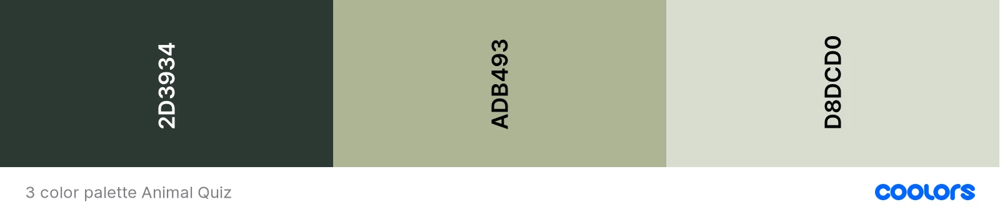
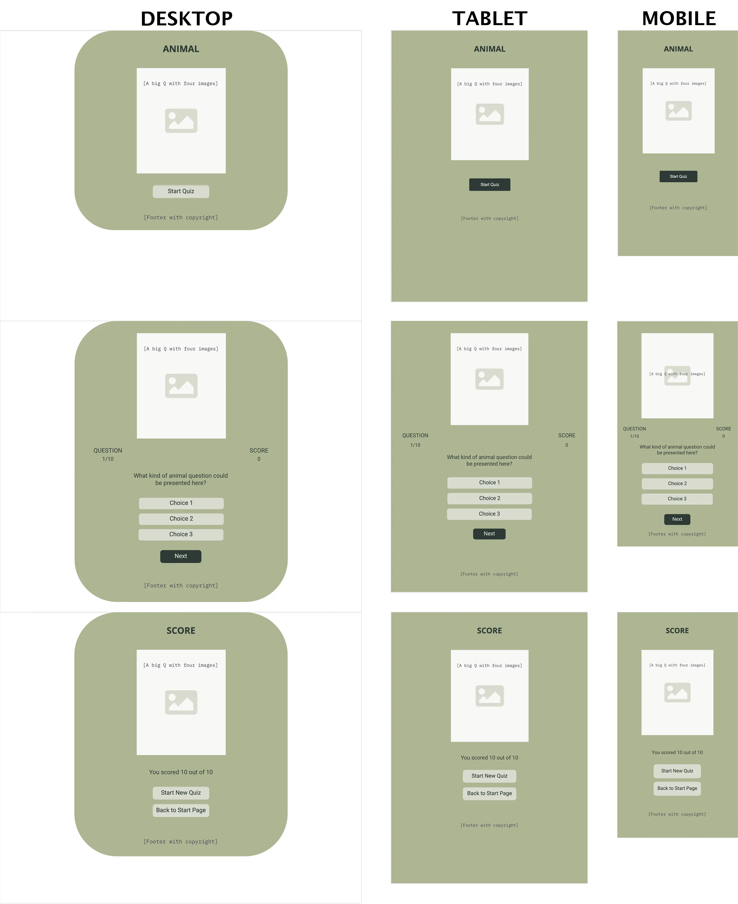

# Animal Quiz

Animal Quiz is a game that aims to test people's knowledge about animals. The game is targeted towards people who want to check what they know about different animals in the world. Animal Quiz will be useful for people in that it is a fun way to test what they know about animals and maybe learn more about them.

<!-- A link to the live website can be found [here](https://mariechessler.github.io/a-quiz/index.html), and a link to the repository [here](https://github.com/MarieCHessler/a-quiz).

 -->

 

## Table of contents
1. [Design](https://github.com/MarieCHessler/a-quiz#design)
    * [Color Palette](https://github.com/MarieCHessler/a-quiz#color-palette)
    * [Typography](https://github.com/MarieCHessler/a-quiz#typography)
    * [Layout](https://github.com/MarieCHessler/a-quiz#layout)
    * [Wireframes](https://github.com/MarieCHessler/a-quiz#wireframes)

2. [Features](https://github.com/MarieCHessler/a-quiz#features)
    * [Existing features](https://github.com/MarieCHessler/a-quiz#existing-features)
    * [Features for the future](https://github.com/MarieCHessler/a-quiz#features-for-the-future)

3. [Technology used](https://github.com/MarieCHessler/a-quiz#technology-used)

4. [Testing](https://github.com/MarieCHessler/a-quiz#testing)
    * [Validator testing](https://github.com/MarieCHessler/a-quiz#validator-testing)
    * [Manual testing](https://github.com/MarieCHessler/a-quiz#manual-testing)

5. [Bugs](https://github.com/MarieCHessler/a-quiz#bugs)
    * [Fixed bugs](https://github.com/MarieCHessler/a-quiz#fixed-bugs)
    * [Known issues](https://github.com/MarieCHessler/a-quiz#known-issues)

6. [Deployment](https://github.com/MarieCHessler/a-quiz#deployment)
    * [GitHub Pages](https://github.com/MarieCHessler/a-quiz#github-pages)

7. [Credits](https://github.com/MarieCHessler/a-quiz#credits)
    * [Content](https://github.com/MarieCHessler/a-quiz#content)
    * [Media](https://github.com/MarieCHessler/a-quiz#media)
    * [Special thanks to](https://github.com/MarieCHessler/a-quiz#special-thanks-to)

     

    ## Design

     

    

    ### Color Palette

    * The game's primary colors are (from left to right)...
      * **Xxx** is used for 
      * **Xxx** is used for 
      * **Xxx** is used for 
    * The colors are all nuances of green, to mirror nature.

    ### Typography

    * Cormorant Garamond is used for headings, since it fits with the Q in the image. Fallback font is serif.
    * Raleway is used for body, scores, choices and buttons, since it is easy to read and complements Cormorant Garamond well. Fallback font is sans serif
    * Both fonts are from Google Fonts, and a good font pairing according to the site Davey & Crista that focuses on brand strategy and design.

    ### Layout
    
    * The content has been divided into three different pages. This way the quiz page, with the questions, is separated from the finish page, where the final score is presented, and the landing page.
    * For desktop and laptops the colored background has been limited to the general container, to keep the eyes' focus mid screen. For tablets and mobiles all the background is colored.

    ### Wireframes

    * Wireframes were used to structure the page content for desktop, tablet, and mobile screens. The structure does not vary a lot between the different screens, since the content is kept mid screen for the game, but margins and font sizes vary.

     

    

     